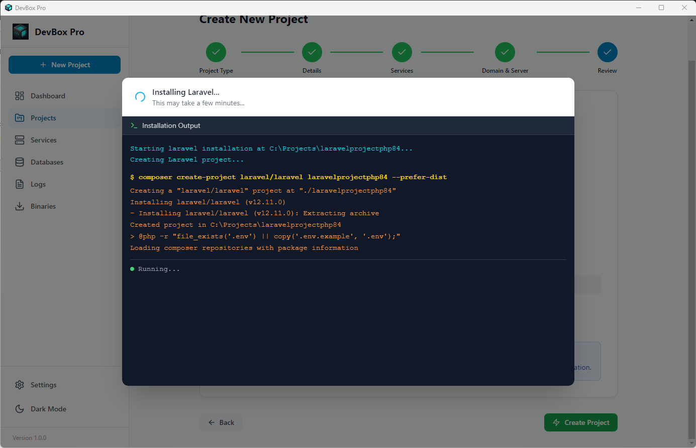
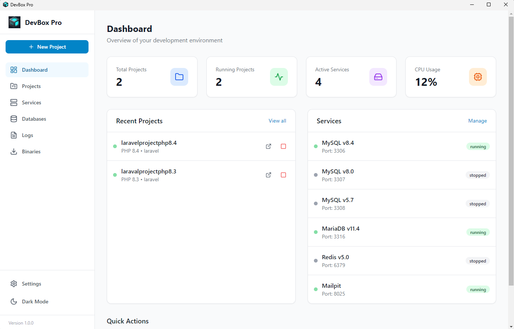
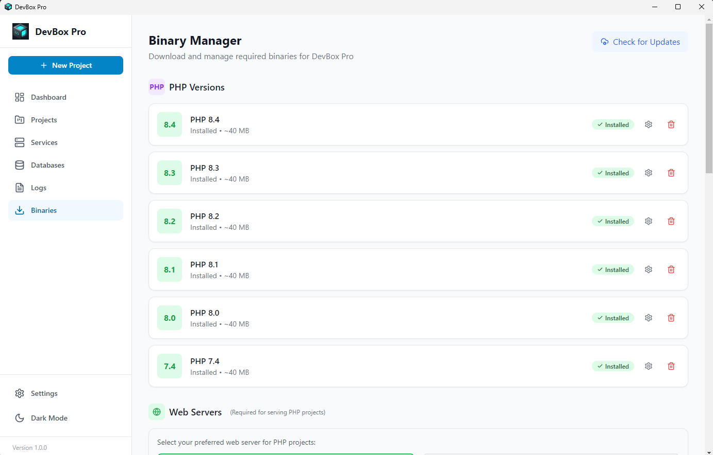
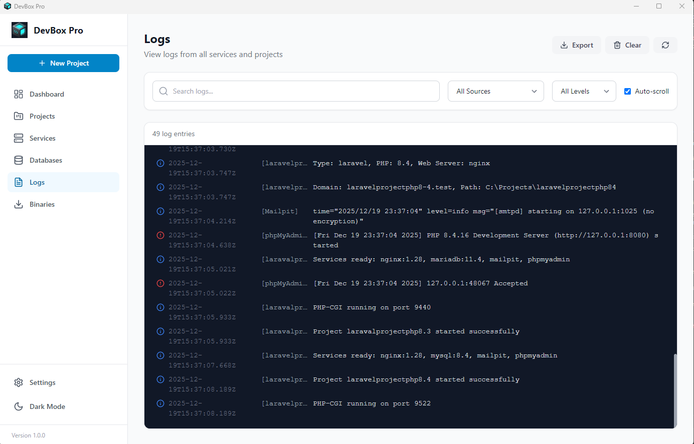
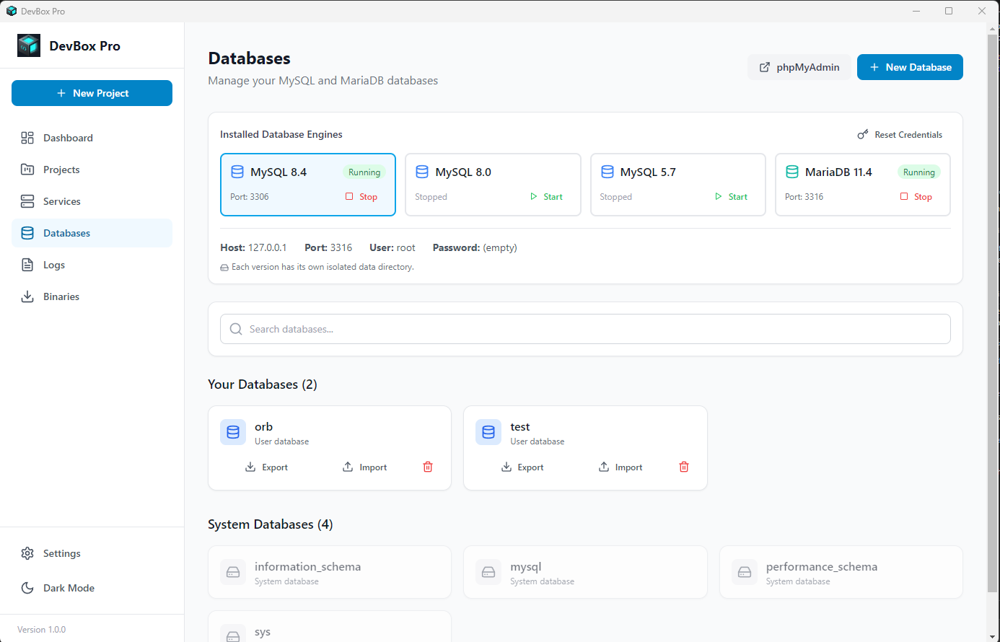
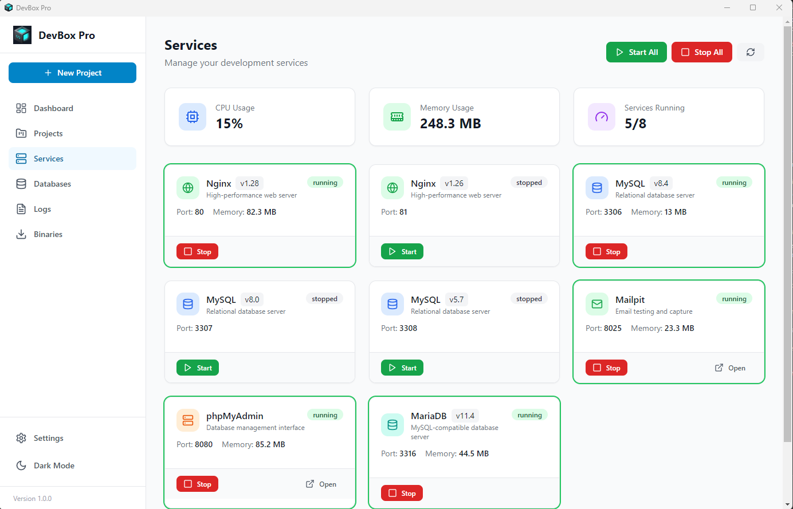
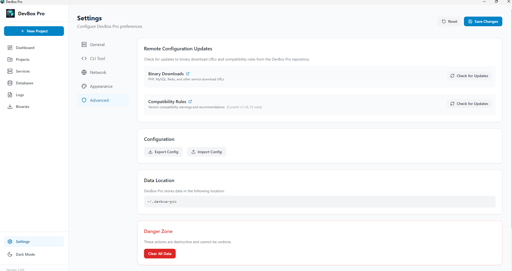

<p align="center">
  
  
  
  
</p>

# 🚀 DevBox Pro

**Run legacy and modern PHP & Node.js apps side by side — no conflicts, no headaches**

Maintaining an old PHP 7.4 project while building a new Laravel 11 app on PHP 8.5? Running a Next.js frontend alongside a PHP backend? DevBox Pro makes it effortless. Unlike traditional setups, you can **run multiple PHP and Node.js versions simultaneously** — giving you the freedom to work on legacy applications alongside cutting-edge projects without switching environments or breaking dependencies.

DevBox Pro bundles everything you need: PHP 7.4 through 8.5, Node.js 16 through 24, MySQL, MariaDB, Redis, Nginx, Apache, and more — all in one standalone desktop app. No Docker, no complex configurations, just instant multi-version development.

---

## ✨ Features

### 🐘 Multi-PHP Version Support
- **PHP 7.4, 8.0, 8.1, 8.2, 8.3, 8.4, 8.5** - Run any version side by side
- Per-project PHP version selection with compatibility validation
- Easy extension management per version with php.ini editor
- Pre-configured for optimal performance

### 🟢 Node.js Project Support
- **Node.js 16, 18, 20, 22, 24** - Run pure Node.js applications
- Per-project Node.js version selection
- Automatic proxy through Nginx/Apache for `.test` domains
- Run Express, Next.js, Nuxt, or any Node.js framework

### 🌐 Web Server Options
- **Nginx 1.26, 1.28** - High-performance, low memory footprint (recommended)
- **Apache 2.4** - Full .htaccess support, mod_rewrite included
- Multi-version support - run different versions per project
- Automatic virtual host creation
- HTTP & HTTPS support for every project

### 📦 Embedded Services
| Service | Versions | Description |
|---------|----------|-------------|
| **MySQL** | 8.0, 8.4 | Powerful relational database |
| **MariaDB** | 10.11, 11.4 | MySQL-compatible, open source |
| **Redis** | 7.2, 7.4 | In-memory cache & session storage |
| **Mailpit** | Latest | Email testing with SMTP server |
| **phpMyAdmin** | Latest | Web-based database management |
| **Node.js** | 16, 18, 20, 22, 24 (LTS) | JavaScript runtime for projects & tooling |
| **Composer** | Latest | PHP dependency manager |

### 💾 Database Management
- **Multi-version support** - Run MySQL 8.0 and MariaDB 11.4 simultaneously
- **Per-version data isolation** - Each version has its own data directory
- **Database import/export** with .gz compression support
- **Progress tracking** for import/export operations
- **phpMyAdmin integration** for web-based management
- **Automatic database creation** per project

### 🔐 SSL & Security
- Automatic SSL certificate generation
- Wildcard certificate support
- One-click certificate trust
- `.test` domain support (e.g., `myproject.test`)

### 🎯 Framework Support
- **Laravel** - Full support with Artisan, Queue Workers, Scheduler
- **Symfony** - Console commands, Doctrine integration
- **WordPress** - WP-CLI ready, Multisite support
- **Custom PHP** - Works with any PHP application
- **Node.js** - Express, Next.js, Nuxt, Fastify, or any Node.js app

### 🔧 Binary Manager
- **Download individual components** - Only install what you need
- **Multi-version management** - Keep multiple versions installed
- **One-click updates** - Easy version upgrades
- **Import custom binaries** - Use your own compiled versions

### ☁️ Cloud Configuration Updates
- **Remote binary definitions** - New versions available without app update
- **Compatibility rules sync** - Updated version compatibility warnings
- **One-click update check** - Check for new binaries and rules from Settings
- **Offline fallback** - Built-in defaults when offline
- **Version tracking** - Only download when updates are available

### 💻 Terminal Commands
- **Direct command access** - Use `php`, `npm`, `node`, `composer` directly from any terminal
- **Automatic version detection** - Detects your project and uses the correct PHP/Node.js version
- **Works everywhere** - VS Code, Windows Terminal, PowerShell, or any terminal emulator
- **No prefix needed** - Just run `php artisan migrate` instead of complex paths
- **Prevents version conflicts** - No more "wrong PHP version" issues

### 📊 Logging & Monitoring
- **Real-time log streaming** per project and service
- **Color-coded log levels** (info, warning, error)
- **Log file rotation** and cleanup
- **Service resource monitoring**

### ⚙️ Project Configuration
- **Service version selection** per project
- **Compatibility validation** - Warns about incompatible combinations
- **Binary validation** - Checks required binaries before project start
- **php.ini editor** - Customize PHP settings per version

---

## 📸 Screenshots

### Laravel Installation

*Fresh Laravel project installation with real-time progress tracking. Watch as DevBox Pro runs Composer, generates app keys, and installs npm dependencies automatically.*

### Viewing Single Project

*Detailed project view showing all configuration options - PHP version, web server selection, database settings, and enabled services. Easily switch between Nginx and Apache, enable/disable Redis, MySQL, or MariaDB per project.*

### Dashboard

*Clean overview of all your projects with quick status indicators. See which projects are running, their domains, PHP versions, and quickly start/stop any project with one click.*

### List of Binaries (Multiple PHP Versions)

*Binary Manager showing all available PHP versions from 7.4 to 8.4. Download only the versions you need, and run different PHP versions for different projects simultaneously.*

### List of Binaries (Web Servers & Databases)

*Download multiple web server and database versions. Choose between Nginx 1.26/1.28, Apache 2.4, MySQL 8.0/8.4, MariaDB 10.11/11.4, Redis 7.2/7.4, and more.*

### Logs

*Real-time log streaming with color-coded output. Filter logs by project or service, see errors highlighted in red, and quickly diagnose issues. Supports PHP, Nginx, Apache, MySQL, and all other service logs.*

### Database Management

*Full database management interface. Create, drop, import, and export databases with ease. Supports .sql and .gz compressed files. Progress tracking for large imports/exports. Quick access to phpMyAdmin for visual management.*

### Running Services

*Global services panel showing all active services. Start/stop MySQL, MariaDB, Redis, Mailpit, and phpMyAdmin independently. Each service displays its current status, version, and port number.*

### Settings & Cloud Updates

*Application settings with cloud configuration updates. Check for new binary definitions and compatibility rules without updating the app. Configure default paths, ports, and preferences.*

---

## 🚀 Quick Start

### Installation

1. **Download** the latest release for your platform:
   - Windows: `DevBox-Pro-Setup-x.x.x.exe`
   - macOS: `DevBox-Pro-x.x.x.dmg`

2. **Install** the application

3. **Download binaries** from the Binary Manager:
   - Click "Download All" for the full stack, or
   - Select individual components as needed

### Creating Your First Project

1. Click **"+ New Project"** on the Dashboard
2. Select your **project type** (Laravel, Symfony, WordPress, Custom PHP, or Node.js)
3. Choose **project folder** and **PHP/Node.js version**
4. Configure **services** (MySQL, Redis, etc.)
5. Set your **domain** (e.g., `myproject.test`)
6. Click **Create** and you're ready!

### Using Terminal Commands

DevBox Pro lets you use `php`, `npm`, `node`, `composer`, `mysql`, and `mysqldump` directly from any terminal with automatic project version detection:

1. Go to **Settings > CLI Tool** in DevBox Pro
2. Enable **"Terminal commands"**
3. Restart your terminal or VS Code

**Usage examples:**
```bash
# Navigate to your project folder
cd C:\Projects\my-laravel-app

# Run PHP with project-specific version (auto-detected)
php artisan migrate
php artisan optimize

# Run Composer with correct PHP version
composer install
composer update

# Run Node.js/npm with project version (if enabled)
npm install
npm run dev
npx vite build

# Connect to MySQL/MariaDB using the active database version
mysql -u root
mysql -u root -p mydb < migration.sql
mysqldump -u root mydb > backup.sql
```

> **How it works:** When you run `php`, `mysql`, or `npm` from a project directory, DevBox Pro automatically uses that project's configured version. Outside a project, it uses your default version set in Settings.

---

## 💻 Development Setup

### Prerequisites

- Node.js 18+ 
- npm or yarn
- Git

### Setup

```bash
# Clone the repository
git clone https://github.com/JeffGepiga/DevBoxPro.git
cd DevBoxPro

# Install dependencies
npm install

# Start development server
npm run dev

# Build for production
npm run build

# Create distribution package
npm run dist
```

### Testing

DevBox Pro includes a comprehensive test suite covering Unit, Integration, and End-to-End (E2E) scenarios.

```bash
# Run all tests
npm test

# Run only main process tests
npm run test:main

# Run only renderer process tests
npm run test:renderer

# Run End-to-End (E2E) tests
npm run test:e2e
```

The E2E tests are built using Playwright and cover the full project lifecycle, database workflows, binary downloads, SSL configuration, and settings persistence.

### Project Structure

```
DevBoxPro/
├── src/
│   ├── main/                    # Electron main process
│   │   ├── services/
│   │   │   ├── PhpManager.js        # PHP version management
│   │   │   ├── ProjectManager.js    # Project lifecycle
│   │   │   ├── ServiceManager.js    # MySQL, MariaDB, Redis, etc.
│   │   │   ├── DatabaseManager.js   # Database operations (CRUD, import/export)
│   │   │   ├── SslManager.js        # SSL certificates
│   │   │   ├── WebServerManager.js  # Nginx/Apache
│   │   │   ├── BinaryDownloadManager.js  # Binary downloads
│   │   │   ├── LogManager.js        # Log management
│   │   │   ├── SupervisorManager.js # Process supervisor
│   │   │   └── ...
│   │   ├── ipc/
│   │   │   └── handlers.js      # IPC communication
│   │   ├── utils/
│   │   │   └── ConfigStore.js   # Configuration storage
│   │   ├── preload.js           # Preload script
│   │   └── main.js              # Main entry
│   │
│   └── renderer/                # React frontend
│       ├── src/
│       │   ├── components/      # Reusable components
│       │   │   ├── Sidebar.jsx
│       │   │   ├── PhpIniEditor.jsx
│       │   │   ├── XTerminal.jsx
│       │   │   └── ...
│       │   ├── pages/           # Page components
│       │   │   ├── Dashboard.jsx
│       │   │   ├── Projects.jsx
│       │   │   ├── ProjectDetail.jsx
│       │   │   ├── Databases.jsx
│       │   │   ├── Services.jsx
│       │   │   ├── BinaryManager.jsx
│       │   │   ├── Settings.jsx
│       │   │   └── ...
│       │   ├── context/         # React context
│       │   │   └── AppContext.jsx
│       │   └── App.jsx          # Root component
│       └── index.html
│
├── resources/                   # App resources (icons, configs)
├── config/                      # Remote configuration files
│   ├── binaries.json            # Binary download definitions
│   ├── compatibility.json       # Version compatibility rules
│   └── README.md                # Config contribution guide
├── screenshots/                 # App screenshots
├── build/                       # Build resources
├── electron-builder.config.js   # Electron builder config
├── package.json
└── README.MD
```

---

## ⚙️ Configuration

### Default Ports

| Service | Default Port |
|---------|-------------|
| PHP Projects | 8000+ (auto-assigned) |
| MySQL | 3306 |
| MariaDB | 3306 (or 3307 if MySQL is running) |
| Redis | 6379 |
| Mailpit SMTP | 1025 |
| Mailpit Web | 8025 |
| phpMyAdmin | 8080 |
| Nginx HTTP | 80 |
| Nginx HTTPS | 443 |
| Apache HTTP | 80 (or 8081 if Nginx is on 80) |
| Apache HTTPS | 443 |

### Environment Variables

Projects can use `.env` files with these pre-configured variables:

```env
APP_ENV=local
APP_DEBUG=true
APP_URL=http://myproject.test

DB_CONNECTION=mysql
DB_HOST=127.0.0.1
DB_PORT=3306
DB_DATABASE=myproject
DB_USERNAME=root
DB_PASSWORD=

CACHE_DRIVER=redis
SESSION_DRIVER=redis
QUEUE_CONNECTION=redis

REDIS_HOST=127.0.0.1
REDIS_PASSWORD=null
REDIS_PORT=6379

MAIL_MAILER=smtp
MAIL_HOST=127.0.0.1
MAIL_PORT=1025
```

---

## 🛠️ Technologies

- **Electron** - Cross-platform desktop framework
- **React** - UI library
- **Vite** - Fast build tool
- **TailwindCSS** - Utility-first CSS
- **electron-builder** - Distribution packaging

---

## 📋 Roadmap

- [x] Multi-PHP version support (7.4 - 8.5)
- [x] MySQL & MariaDB multi-version support
- [x] Redis multi-version integration  
- [x] Nginx & Apache multi-version web servers
- [x] Automatic SSL certificates
- [x] Virtual host management
- [x] Node.js & npm multi-version support
- [x] Pure Node.js project support (Express, Next.js, etc.)
- [x] Composer integration
- [x] Database import/export with compression
- [x] Per-project service version selection
- [x] Binary validation before project start
- [x] php.ini editor
- [x] Real-time log streaming
- [x] Cloud config updates (binaries & compatibility rules)
- [ ] Docker container support
- [ ] PostgreSQL support
- [ ] MongoDB support
- [ ] Project templates
- [ ] Extension marketplace
- [ ] Cloud sync settings

---

## 🤝 Contributing

Contributions are welcome! Please feel free to submit a Pull Request.

1. Fork the repository
2. Create your feature branch (`git checkout -b feature/AmazingFeature`)
3. Commit your changes (`git commit -m 'Add some AmazingFeature'`)
4. Push to the branch (`git push origin feature/AmazingFeature`)
5. Open a Pull Request

---

## 📄 License

This project is licensed under the MIT License - see the [LICENSE](LICENSE) file for details.

---

## 💬 Support

- 📧 Email: jeffreygepiga27@gmail.com
- 🐛 Issues: [GitHub Issues](https://github.com/JeffGepiga/DevBoxPro/issues)
- 💬 Discussions: [GitHub Discussions](https://github.com/JeffGepiga/DevBoxPro/discussions)

---

<p align="center">
  Made with ❤️ for PHP & Node.js developers
</p>